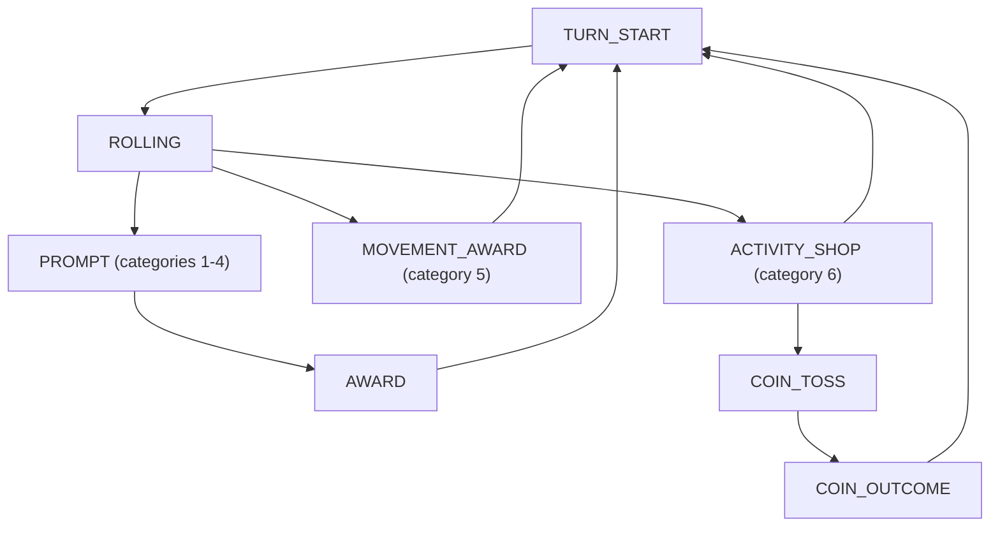
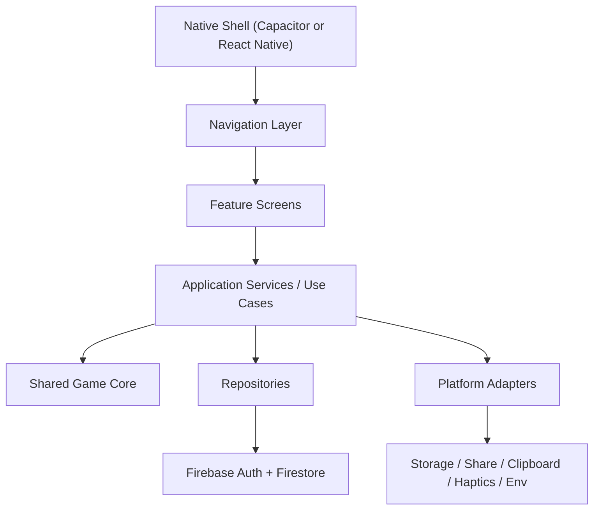

# Intima-Date Mobile Architecture

## Purpose

This document describes the current web app architecture in this repository and a recommended target architecture for turning it into an iOS and/or Android app.

Everything in the "Current system" sections is based on code inspection of this repo on 2026-03-15. Recommendations are labeled as recommendations, not facts.

## Sources Inspected

- `src/main.jsx`
- `src/routes/AppRoutes.jsx`
- `src/services/firebase.js`
- `src/services/setupStorage.js`
- `src/services/activityStore.js`
- `src/game/useGameState.js`
- `src/game/initialGameState.js`
- `src/game/gameplayStore.js`
- `src/game/dice/DiceEngine.js`
- `src/components/gameboard/dice/*`
- `src/pages/Create/*`
- `src/pages/Join/Join.jsx`
- `src/pages/Game/GameBoard.jsx`
- `src/pages/Game/GameBoard.css`
- `src/game/data/*`
- `package.json`

## Executive Summary

The current app is a client-rendered React/Vite single-page app that uses Firebase Anonymous Auth and Firestore for multiplayer state. The strongest architectural decision already in place is the split between:

- `games/{gameId}` for setup, role assignment, activity negotiation, and approvals
- `gameplay/{gameId}` for live turn-by-turn gameplay

That split is the right foundation for mobile as well.

The main migration constraint is that the product logic is mixed with web-specific UI and browser APIs:

- navigation is coupled to `react-router-dom`
- persistence is coupled to `localStorage`
- invite sharing is coupled to `navigator.clipboard`
- rendering is coupled to DOM/CSS and a web `Canvas`
- gameplay mutations are coupled to Firestore writes inside UI-facing modules

## Recommendation

There are two viable mobile paths:

1. `Capacitor + existing React/Vite app`
2. `Shared game core + React Native app`

Based on the current codebase, the lower-risk path is:

1. Extract shared game/domain logic out of the current UI modules.
2. Keep the first mobile release on the existing React web stack inside Capacitor.
3. Only do a full React Native rewrite if you later decide native UX, native navigation, or deeper device integration are worth the rewrite cost.

That recommendation is based on the repo as it exists today:

- most screens are DOM/CSS based
- the game board already has mobile CSS breakpoints
- the 3D dice currently depends on web `react-three-fiber`
- there is no shared domain package yet

## Current System

### Runtime stack

Observed in `package.json`:

- React 19
- Vite 7
- `react-router-dom` 7
- Firebase 12
- `@react-three/fiber`, `@react-three/drei`, `three`
- `styled-components` and `framer-motion` are installed

### App bootstrap

Observed in `src/main.jsx`:

1. Run `runIdentityMigrations()`
2. Ensure Firebase anonymous auth with `ensureAnonymousAuth()`
3. Render the app under `BrowserRouter`

Implication for mobile:

- the app assumes browser routing
- anonymous auth happens before the UI renders
- boot failures currently log to console but do not route to an explicit error state

### Route map

Observed in `src/routes/AppRoutes.jsx`:

- `/` -> warning portal
- `/consent`
- `/onboarding`
- `/onboarding/slides`
- `/menu`
- `/join`
- `/create/player-one`
- `/create/player-two`
- `/create/remote-invite/:gameId`
- `/create/waiting/player-one/:gameId`
- `/create/waiting/player-two/:gameId`
- `/create/activities/:gameId`
- `/create/activities-review/:gameId`
- `/create/summary/:gameId`
- `/instructions`
- `/components`
- `/game/:gameId`
- `/testdie`

### High-level feature areas

The app currently breaks down into four functional areas:

1. Entry and consent flow
2. Create/join and activity negotiation flow
3. Gameplay flow
4. Support content and developer/demo screens

## Current Architecture by Layer

### Presentation layer

The presentation layer lives mostly in:

- `src/pages/**`
- `src/components/**`
- `src/pages/Game/GameBoard.css`
- other page/component CSS files

This layer is web-specific today because it depends on:

- DOM elements
- CSS files
- `BrowserRouter` navigation
- browser viewport assumptions like `100vh`

Observed mobile-related detail:

- `src/pages/Game/GameBoard.css` already includes a mobile breakpoint at `max-width: 880px`
- many screens still rely on full viewport web layout patterns (`100vh`, `100vw`, fixed/overlay behavior)

### Local client state and session bootstrap

The main session/bootstrap modules are:

- `src/services/setupStorage.js`
- `src/services/identityMigrations.js`
- `src/services/firebase.js`

Observed local storage keys:

- `intimadate.identity`
- `intimadate.setup`
- `intimadate.games` in `src/services/storage.js`

Important detail:

- `src/services/storage.js` exists but is not used by the current routing/gameplay path
- `src/services/gameStore.js` also exists but is not used by the current two-document gameplay flow

This suggests there is legacy or unfinished persistence code that should not be treated as current architecture authority.

### Realtime sync and backend access

Observed backend access is entirely client-side through the Firebase SDK:

- Auth: `signInAnonymously`
- Firestore reads/writes/listeners: `getDoc`, `setDoc`, `updateDoc`, `onSnapshot`

There is no server code, Cloud Function code, or Firestore rules file in this repo, so those parts cannot be documented from the repo itself.

### Domain logic

The domain logic is spread across:

- `src/services/activityStore.js`
- `src/game/gameplayStore.js`
- `src/game/initialGameState.js`
- `src/game/dice/DiceEngine.js`
- `src/game/data/activityList.js`
- `src/game/data/promptCards.js`
- `src/game/data/movementCards.js`

This domain logic is reusable in concept, but not yet isolated as a pure shared core because it currently mixes:

- state transitions
- randomness
- Firebase writes
- UI-driven timing

## Current Backend Model

### Collection 1: `games/{gameId}`

Observed purpose:

- game setup
- role assignment
- player identity mapping
- activity negotiation
- approvals
- pre-game summary

Observed fields:

| Field | Type | Notes |
| --- | --- | --- |
| `roles` | object | `{ playerOne, playerTwo }` token mapping |
| `players` | array | two players with `name`, `color`, `tokens`, `inventory`, `token` |
| `activityDraft` | array | editable draft activity list |
| `baselineDraft` | array | baseline list used for review diff |
| `finalActivities` | array | finalized negotiated activities |
| `approvals` | object | `{ playerOne, playerTwo }` |
| `editor` | string or `null` | edit lock owner token |
| `gameReady` | boolean | written during create flow; not used elsewhere in inspected code |

Observed main access points:

- create: `src/pages/Create/PlayerOne.jsx`
- join: `src/pages/Create/PlayerTwo.jsx`, `src/pages/Join/Join.jsx`
- edit/review/summary/waiting: `src/services/activityStore.js` and related create pages

### Collection 2: `gameplay/{gameId}`

Observed purpose:

- turn-by-turn live gameplay after setup is finished

Observed fields from `src/game/initialGameState.js` and `src/game/gameplayStore.js`:

| Field | Type | Notes |
| --- | --- | --- |
| `gameId` | string | copied in at init |
| `players` | array | two players, each starts at 10 tokens for gameplay |
| `currentPlayerId` | number | `0` or `1` |
| `phase` | string | current state machine phase |
| `promptDecks` | object | per-category prompt decks |
| `activePrompt` | object or `null` | current prompt |
| `lastDieFace` | number or `null` | last rolled face |
| `lastCategory` | number or `null` | mapped category |
| `awardedMovementCard` | object or `null` | movement card just earned |
| `reversePrompt` | boolean | set by movement cards |
| `doubleReward` | boolean | set by movement cards |
| `negotiatedActivities` | array | copied from `games/{gameId}.finalActivities` |
| `activityShop` | object or `null` | runtime shop UI state |
| `pendingActivity` | object or `null` | selected activity waiting for coin flip |
| `activityResult` | object or `null` | resolved activity outcome |
| `coin` | object | `{ isFlipping, result }` |
| `updatedAt` | server timestamp | write timestamp |

Observed main access points:

- initialization: `src/pages/Create/Summary.jsx`
- subscription and writes: `src/game/useGameState.js`, `src/game/gameplayStore.js`

## Current Identity and Persistence Model

### Authentication

Observed in `src/services/firebase.js`:

- Firebase Anonymous Auth is the only auth path in the repo
- local per-game identity is mapped to `auth.currentUser.uid`

### Device identity mapping

Observed in `src/services/setupStorage.js`:

- each game stores a local identity map entry under `intimadate.identity`
- shape is `{ [gameId]: { token: "<firebase uid>" } }`

Observed in `src/services/identityMigrations.js`:

- boot-time migration cleans older identity shapes

### Local setup state

Observed in `src/services/setupStorage.js`:

- `intimadate.setup` stores local flow state like `gameId`, player names/colors, and `localPlay`

### Resume behavior

Observed facts:

- the game board tells users to keep the game ID to resume later
- there is no inspected in-app "resume recent game" feature wired to current routing
- `src/services/storage.js` suggests a prior or planned local save/resume mechanism, but it is not used by the current gameplay path

## Current Gameplay State Machine

Observed phases:

- `TURN_START`
- `ROLLING`
- `PROMPT`
- `AWARD`
- `MOVEMENT_AWARD`
- `ACTIVITY_SHOP`
- `COIN_TOSS`
- `COIN_OUTCOME`

Observed base flow:



Observed movement-card variants:

- `skip_prompt`
- `reverse_prompt`
- `reroll`
- `reset`
- `ama_bonus`
- `double_reward`

Important architecture observation:

The current gameplay state machine is implemented imperatively inside `src/game/gameplayStore.js`, not as a pure reducer/state machine package. That is workable on web, but it increases migration cost because the mobile app cannot reuse the logic cleanly until it is extracted from Firestore write code.

## Current Randomness Sources

Observed random sources:

- game code generation in `src/services/gameId.js`
- prompt deck shuffle in `src/game/initialGameState.js`
- movement-card draw in `src/game/data/movementCards.js`
- coin flip in `src/game/gameplayStore.js`
- dice angular velocity in `src/game/dice/DiceEngine.js`

Recommendation:

Centralize randomness behind a small interface before mobile work begins. That will make:

- unit tests practical
- replay/debugging practical
- web and mobile behavior consistent

## Portability Assessment

### Mostly reusable with minimal change

- content data in `src/game/data/*`
- the two-collection Firestore split
- the concept of per-game local identity mapping
- most gameplay rules after extraction from Firebase writes
- `DiceEngine` math logic after extraction from web rendering concerns

### Reusable only after refactor

- `activityStore` negotiation logic
- `gameplayStore` turn logic
- game/session boot flow
- invite/resume use cases

These modules currently combine domain rules and platform/backend access.

### Web-only today

- `react-router-dom` page navigation
- DOM/CSS components in `src/pages/**` and `src/components/**`
- `localStorage`
- `navigator.clipboard`
- web `Canvas` rendering path for the 3D die
- Vite `import.meta.env`

## Mobile Architecture Options

### Option A: Capacitor around the existing React/Vite app

Best for:

- fastest path to App Store / Play Store builds
- highest code reuse
- preserving the current UI/CSS/route structure
- preserving the current 3D dice path with the least rework

Strengths against the current repo:

- current React DOM components can stay
- current CSS can stay
- current `react-router-dom` setup can mostly stay, though routing/deep-link behavior still needs validation
- Firebase web SDK usage stays much closer to current code
- `react-three-fiber` web usage stays much closer to current code

Costs and risks:

- you are still shipping a web app inside a native shell
- browser APIs should still be wrapped behind platform adapters
- safe-area, keyboard, app-backgrounding, and lifecycle issues need explicit mobile work
- app performance and feel will still be constrained by WebView behavior

### Option B: Shared game core plus React Native app

Best for:

- long-term native UX
- native navigation and native UI patterns
- deeper device integration later
- a cleaner architecture if the product will keep growing

Strengths:

- stronger separation between game logic and presentation
- better long-term maintainability if you expect significant mobile-specific UX
- easier to introduce true native patterns later

Costs against the current repo:

- nearly all UI code must be rewritten
- CSS files are not reusable
- `react-router-dom` must be replaced
- browser storage and clipboard code must be replaced
- the dice rendering stack requires a new native-compatible implementation or a simplified replacement

## Recommended Target Architecture

### Recommendation summary

Recommended path based on the current codebase:

1. Extract a shared core first.
2. Keep the first mobile release on Capacitor unless you explicitly want a native-first rewrite now.
3. Preserve the current two-document backend split.
4. Add platform adapters so the shared core does not know whether it is running on web or mobile.

### Target layers



### Target module responsibilities

#### 1. Shared Game Core

This should be a pure JS or TS package with no React, no DOM, and no Firebase imports.

Recommended responsibilities:

- game IDs
- schema definitions
- prompt/activity/movement card content
- negotiation domain rules
- gameplay state machine
- random source abstraction
- validators and serializers

Recommended output:

- pure functions
- deterministic reducers/command handlers
- testable state transitions

#### 2. Application services

These orchestrate use cases and call repositories/adapters.

Recommended use cases:

- bootstrap anonymous session
- create game
- claim player two slot
- subscribe to negotiation state
- save draft activities
- approve activities
- initialize gameplay
- perform gameplay action
- resume existing game

#### 3. Repositories

Repositories should own backend persistence details.

Recommended repository split:

- `NegotiationRepository`
- `GameplayRepository`
- `SessionRepository`

Each repository should hide:

- Firestore collection names
- document schemas
- transactions
- subscriptions
- retry or version checks

#### 4. Platform adapters

Create explicit adapters for everything that is browser-only today:

- persistent local storage
- clipboard/share
- environment config
- app lifecycle hooks
- haptics if added later

This is important even if you choose Capacitor, because it removes direct browser assumptions from feature code.

## Proposed Folder Direction

One reasonable direction inside this repo:

```text
src/
  app/
    router/
    providers/
  features/
    create/
    join/
    negotiation/
    gameplay/
    onboarding/
  core/
    content/
      prompts.js
      activities.js
      movementCards.js
    ids/
      gameId.js
    negotiation/
      negotiationMachine.js
      negotiationSelectors.js
    gameplay/
      gameplayMachine.js
      gameplaySelectors.js
      phases.js
    random/
      randomSource.js
    schemas/
      games.js
      gameplay.js
  data/
    firebase/
      negotiationRepository.js
      gameplayRepository.js
      authRepository.js
  platform/
    web/
      storageAdapter.js
      shareAdapter.js
      envAdapter.js
    mobile/
      storageAdapter.js
      shareAdapter.js
      envAdapter.js
```

If you decide to do a React Native app later, `src/core/**` can move into a shared package without changing its API.

## Backend Recommendations

### Keep the two-document split

Do not collapse `games/{gameId}` and `gameplay/{gameId}` into one document. The current split is useful and should remain:

- setup/negotiation has different write patterns and different UI states than live gameplay
- gameplay can evolve independently after setup is complete
- the split makes subscriptions simpler

### Add schema versioning

Recommendation:

- add `schemaVersion` to both documents
- add explicit `status` to the `games` document, for example `SETUP`, `NEGOTIATING`, `READY`, `IN_PROGRESS`, `ENDED`

This will help web and mobile coexist during migration.

### Harden create/join flows

Observed current behavior:

- game IDs are generated on the client from a word plus a 3-digit number
- the inspected create flow does not check for an existing document before `setDoc`
- player-two claiming is done client-side

Recommendation:

- reserve game IDs transactionally, or move ID creation to a trusted backend path
- claim `playerTwo` with a transaction or other atomic protection

These are not mobile-only concerns, but mobile launch is a good time to harden them.

### Add explicit security rules review

The repo does not contain Firestore rules, so this is currently unknown from the codebase.

Before shipping native apps, review and enforce at minimum:

- who can read a game
- who can claim a role
- who can edit negotiation state
- who can write gameplay state
- whether a non-member can guess a game ID and read it

## State Management Recommendations

### Extract state transitions from Firestore writes

Current issue:

- `src/game/gameplayStore.js` both decides the next state and writes it
- `src/services/activityStore.js` both decides negotiation behavior and writes it

Recommendation:

- create pure transition functions first
- let repositories only persist already-computed state changes

That allows:

- web and mobile to share the same rules
- emulator tests and unit tests
- easier debugging

### Introduce selectors

The current screens compute role, partner, turn ownership, and redirect conditions directly inside components.

Recommendation:

- add selectors like `selectMyRole`, `selectPartner`, `selectCanEdit`, `selectCanApprove`, `selectCurrentPlayer`, `selectCanAct`

That keeps navigation and UI logic consistent across web and mobile.

## 3D Dice Strategy

### Current implementation

Observed stack:

- `DiceEngine` controls roll math and final face resolution
- `DiceCanvas` uses `@react-three/fiber`
- `DieMesh` uses `three` materials, textures, and a physical material/glow setup

### Recommendation

If you choose Capacitor:

- keep the current dice implementation first
- optimize only after device testing

If you choose React Native:

- keep `DiceEngine` as shared core logic if possible
- decide separately whether to:
  - reimplement the 3D die with a native-compatible renderer, or
  - replace it with a simpler 2D/native animation

Do not make the full mobile migration depend on perfect 3D parity if schedule matters.

## Navigation and Screen Architecture for Mobile

### Current screen groups

Recommended mobile grouping:

1. Entry flow
2. Create/join flow
3. Negotiation flow
4. Gameplay flow
5. Utility/settings/help flow

### Recommended mobile screen states

Even if you keep route-style navigation, model these as stateful flows rather than raw page copies:

- `ConsentFlow`
- `CreateGameFlow`
- `JoinGameFlow`
- `NegotiationFlow`
- `GameplayFlow`

The current waiting-room logic is already state-driven by Firestore snapshots. That should remain data-driven in mobile as well.

## Persistence and Resume on Mobile

### Recommendation

Replace direct `localStorage` usage with a storage abstraction immediately.

Why:

- Capacitor and React Native do not share the same storage APIs
- WebView local storage is not the best long-term contract for a mobile app

Suggested stored items:

- per-game local identity token mapping
- last active game ID
- recent game list
- local player preferences

Recommendation:

- keep Firebase Auth responsible for auth session persistence
- keep local storage responsible only for lightweight app/session metadata

## Platform-Specific Concerns

### Browser-only APIs observed

- `navigator.clipboard.writeText(gameId)` in `src/pages/Create/RemoteInvite.jsx`
- `localStorage` in setup and legacy storage modules
- `BrowserRouter` in `src/main.jsx`
- `import.meta.env` in `src/services/firebase.js`

### Mobile work items these imply

- replace clipboard-only invite flow with a share adapter
- replace direct `localStorage` calls with a storage adapter
- validate router strategy under native shell launch/resume/deep link behavior
- replace direct env access with environment/config injection that works in mobile builds

### Lifecycle work not present in the web app

The current repo does not show explicit handling for:

- app background/foreground transitions
- network reconnect handling beyond Firestore SDK behavior
- push notifications
- deep links
- crash reporting

Those are not required to create a mobile app, but they are mobile architecture decisions you will need to make.

## Testing Strategy

Observed current scripts:

- `dev`
- `build`
- `lint`
- `preview`

No automated unit, integration, emulator, or end-to-end test setup was visible in the inspected package scripts.

### Recommended mobile test pyramid

1. Unit tests for the shared core
2. Repository tests against Firebase emulator or a safe test project
3. End-to-end tests for create/join/play on two devices or two app instances
4. Device smoke tests for background/resume, reinstall, bad network, and auth recovery

Minimum valuable shared-core tests:

- create game state
- join/claim role
- draft activity edits
- approval completion
- gameplay phase transitions
- movement-card effects
- coin-flip resolution
- turn switching

## Migration Plan

### Phase 0: Stabilize current architecture

- identify and mark legacy modules (`src/services/storage.js`, `src/services/gameStore.js`) as legacy or remove them from the active design
- document the authoritative schemas for `games` and `gameplay`
- decide whether to keep the current dice implementation unchanged for v1 mobile

### Phase 1: Extract shared core

- move game-content data into a clean `core` area
- extract negotiation rules out of `activityStore`
- extract gameplay transitions out of `gameplayStore`
- add selectors for common role/turn logic
- add unit tests

### Phase 2: Add platform and repository adapters

- wrap local storage
- wrap share/clipboard
- wrap config/env loading
- hide Firestore collection operations behind repositories

### Phase 3A: Ship with Capacitor

- integrate native shell
- adapt invite/share behavior
- validate auth persistence on device
- validate Firestore listeners on background/resume
- tune safe areas, keyboard handling, and game board layout

### Phase 3B: Optional later React Native migration

- reuse `core`
- rewrite UI and navigation natively
- choose a native-compatible dice path
- keep backend contracts the same

### Phase 4: Back-end hardening

- transactional game creation and join
- schema versioning
- rules review
- telemetry/crash reporting if desired

## Open Questions

These items were not answerable from the repo alone:

- Firestore security rules
- whether a trusted backend or Cloud Functions exist outside this repo
- whether offline play is required
- whether the first mobile release should feel native or simply be store-installable
- whether deep links and push notifications are required
- whether the 3D dice is a hard requirement for the first mobile release

## Recommended Next Step

If the goal is the fastest credible path to mobile without rewriting the product twice, the next technical step should be:

1. extract `gameplayStore` and `activityStore` rules into a shared `core`
2. add adapters for storage/share/env
3. package the existing React app in Capacitor

If the goal is a native-first product and schedule is secondary, skip the shell approach and build a React Native app on top of the extracted `core`.
